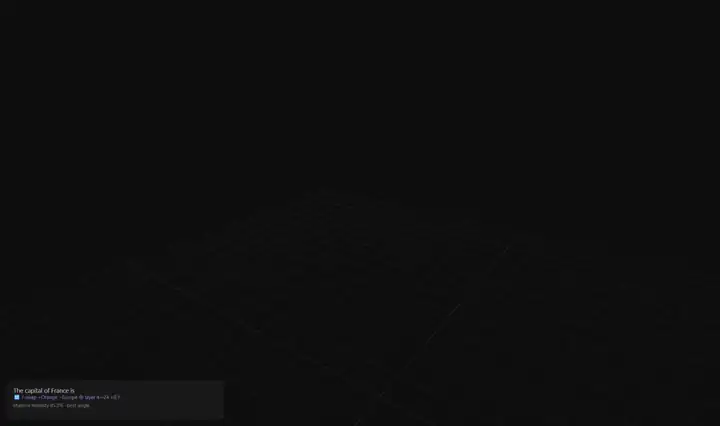

# Residual Walker

Watch a real transformer draw its residual-stream path through 3D space, one
Euler step at a time, until it fires a token.


Every layer in a transformer updates the hidden state by **addition**:
`h = h + attention(norm(h))`, then `h = h + mlp(norm(h))` — each `+` is one
forward-Euler step. Residual Walker runs a small LLM locally, captures the
hidden state at every sub-layer boundary (embedding + each attention add +
each MLP add), projects the states down to 3D with PCA, and animates the
path growing in your browser. At every point it applies the **logit lens**
(final norm + unembedding) so you can watch which token the model *would*
pick if the path stopped there.

## Quick start


**Windows, no Python needed** — grab `ResidualWalker.exe` (from the repo's
Releases page), drop it in this folder,
double-click. First run bootstraps everything: a private Python environment,
the right PyTorch build (CUDA if you have an NVIDIA GPU, CPU otherwise), and
a model of your choice from a picker. Later runs go straight to launch.

**With Python 3.10+ installed** (Windows/Linux/macOS):

```bash
python launcher.py
```

The browser opens automatically when the server is ready.

**Fully manual** (if you'd rather own the environment):

```bash
python -m venv .venv
.venv/Scripts/pip install -r requirements.txt --extra-index-url https://download.pytorch.org/whl/cu128
.venv/Scripts/python server.py     # then open http://127.0.0.1:8471
```

(Use `/whl/cpu` instead of `/whl/cu128` on machines without an NVIDIA GPU;
on Linux/macOS the venv paths are `.venv/bin/...`.)

**Which model?** Start with the picker's default, **Llama 3.2 1B**: it packs
its compute into 16 layers, so every Euler step is big and the paths launch
like fireworks. Qwen3 models spread the
same work over more, gentler layers (comet trails instead of rockets) and
bring a pre-fitted **J-lens**. Watching the *same prompt* on both families is a
great first experiment: every model thinks in its own coordinate system.

## What you're looking at

- **White sphere** — the token's embedding: where the path starts.
- **Blue segments/spheres** — attention adds (context pulled from other tokens).
- **Orange segments/spheres** — MLP adds (facts/associations recalled).
- **Purple arcs** — the k/v stream: which earlier tokens this attention add
  actually read from, weighted by attention (see below).
- **Floating label** — the logit-lens top guess *at that point on the path*;
  the side panel shows the top-5 with probabilities.
- **Ring flash** — the head fires: the finished vector is compared against
  every vocabulary direction and the winner becomes the next token.
- **Gray ghosts** — earlier tokens' paths. Every generated token is a
  complete new trip through all the layers.

Try `The capital of France is` at temperature 0 and watch "Paris" take over
the lens partway through the layers — that's the retrieval moment.

**Everything is clickable.** Click any sphere on the path to pause and park
the lens there; click a **generated token in the story box** to jump to the
walk that fired it (it lights up blue on hover); scrub with **←/→** even
after the walk is done. The whole scene is one linked selection: lens,
inspector, and arcs always describe the same point.

## The k/v stream — watching attention read


A transformer token's walk is private except for one channel: at every
layer, each token publishes a **key** and **value** computed from its
current state, and every later token's attention reads that board. 

Tick **🟣 k/v stream** and every attention add sprouts arcs from the tokens
it read, weight riding in brightness, with a pulse traveling along each arc
from source to reader. Prompt tokens appear as extra-faint anchor trails so
the arcs have somewhere to come from. The arc geometry is honest: each arc
leaves from the source token's state *entering* that layer — the exact
vector its k/v were computed from — and lands on the reader's attention add.

(Position 0 is omitted from arcs on purpose, it's the attention sink, a
parking spot that soaks up default attention mass. Weights therefore don't
sum to 1)

## The point inspector — q/k/v under the microscope

Click any blue attention point (or scrub to it) and the **point inspector**
panel fills in:

- **Where this query looked** — the exact attention weights behind the arcs
  on screen (max over heads, sink omitted).
- **q / k / v heatmaps** — one row per head, one column per head dimension.
  The k and v rows are what this token published to the stream at this
  layer; q is the question it asked. On GQA models you'll see fewer k/v
  heads than q heads (the panel labels the sharing, e.g. "32 q heads → 8 kv
  heads · groups of 4 share k/v").
- **‖q‖ per head** — which heads are loud at this point.

The heatmaps show the raw projection outputs — a *content view* (pre-RoPE,
and pre-QK-norm on Qwen3), not the rotated vectors the attention dot product
sees; the attention weights shown alongside are exact. Fetches are on-demand
and cached, so scrubbing stays instant.

## The J-lens: watching silent thoughts

For supported models the walker also carries a **Jacobian lens** (J-lens),
from Anthropic's paper *Verbalizable Representations Form a Global Workspace
in Language Models*. The logit lens asks *"what if the head fired right
here?"* — near the final layers that collapses into the token about to be
emitted (the paper's "motor regime"). The J-lens asks a different question:
*"what is this state disposed to make the model say, eventually?"* It
transports the state through the model's **average remaining flow** — one
fitted matrix per layer, `J_l = E[∂h_final/∂h_l]`, averaged over a corpus —
then decodes with the model's own unembedding. In the paper this readout
surfaces intermediate reasoning steps, silent plans, and private assessments
that never appear in the output.

When a pre-fitted lens exists for the loaded model (fitted by
[Neuronpedia](https://huggingface.co/neuronpedia/jacobian-lens) with
Anthropic's [jlens](https://github.com/anthropics/jacobian-lens)), the
walker downloads it automatically and a **logit / J-lens toggle** appears
above the lens panel.

Lens-ready models: **Qwen3 1.7B / 4B / 8B / 14B / 32B**, Qwen2.5-7B-Instruct,
and Llama-3.1-8B(-Instruct). Point `RESIDUAL_WALKER_JLENS=<lens.pt>` at a
lens you fitted yourself for anything else, or set it to `off` to disable.

## Grand tour & shadow honesty

The 3D view is a *shadow* of the model's full hidden space (2048 dimensions
for Llama 3.2 1B) — like a hand shadow on a wall, cast from the single most
informative angle (top-3 PCA). Tick **🖐 grand tour** to slowly turn the
hand: the projection frame rotates through the top-12 principal directions
and hidden structure swings into view while the paths morph. Untick and it
eases back to the best angle.

The **shadow honesty** meter (top-left) shows what fraction of the paths'
true spread is visible through the current angle — watch it drop as the
tour turns away from the best angle and recover as it swings back.

## Nudge the stream (activation patching)



<sup>Qwen3-1.7B · prompt “The capital of France is” · J-swap +Orange −Europe · sticky, layers 4→24 · strength 0.1 · temp 0.7 · 48 tokens · 2× speed</sup>

The spider→ant experiment from Anthropic's global-workspace research, at
home: pick an **add concept** and/or **remove concept**, a layer, and a
strength, tick **inject during walks**, and every generated token gets a
steering vector `strength · ‖h‖ · unit(add − remove)` added to its residual
stream right after that layer (built from the concepts' unembedding rows).
A violet diamond marks the nudge point on the path.

The PCA projection is always fit on the unpatched prompt, so a nudged walk
and a clean walk of the same prompt render in the same coordinates.

**Whole phrases work too** — a multi-token concept switches the nudge to
activation-based directions (ActAdd/CAA style): the phrase is run through
the model and its mean residual state at each layer becomes that layer's
steering direction (the export overlay marks these runs "phrase vibes").
One craft note: a lone phrase mostly carries generic "phrase-ness" and acts
like an unlabeled kick. The real technique is a **contrast pair** — matched
phrases in *add* and *remove* so everything shared cancels and only the
difference steers. 

**Sticky steering** — tick *sticky* to re-apply the patch at every layer
from *at layer* through *to layer* (defaults to the ¾ mark: re-injecting in
the final "motor zone" layers just parrots the token instead of steering the
thought). One-shot early nudges get healed by the network's self-repair;
sticky ones outrun it — this is how Golden-Gate-style continuous steering
works. It compounds hard across the range, so the steering window is tiny
and finding it is the game. 

When a J-lens is loaded, a second patch mode appears: **J-swap**, modeled on
the paper's intervention. Instead of pushing the state along a direction, it
reads the state's coordinates in the frame of the two concepts' *J-lens
vectors* (`v_w = J_lᵀ·u_w` — the unembedding row pulled back through the
fitted transport), exchanges the two coordinates at **every position**, and
writes the result back, leaving everything orthogonal untouched. Strength
1.0 is the exact swap.


## MP4 export

Tick **⏺ record walk → MP4** before hitting Walk. The scene is recorded
live (including your own camera moves and the k/v arcs) with an overlay card
carrying the prompt, the story so far, the step readout, and the logit-lens
bars. When the walk ends the
server transcodes with NVENC on the GPU (CPU x264 fallback) and a download
link appears; files land in `exports/`. Requires `ffmpeg` on your PATH.

## Models


Any ungated HuggingFace causal LM with Llama-style module structure works —
Llama, Qwen 2/2.5/3, and Mistral families. The launcher's picker offers a
few presets; paste any other id at the prompt. Notes:

- **Llama 3.2 1B** (the default) gives the most dramatic paths — few layers,
  big steps. Qwen3 models trade drama for the J-lens and finer-grained
  stacks.
- Meta's official `meta-llama/*` repos are approval-gated; the `unsloth/*`
  mirrors are the same weights, ungated.
- Change your saved choice with `python launcher.py --reset-model`
  (or delete the `.model` file).
- Bigger models mean more layers per path and slower walks; 1B-class models
  are the sweet spot for watching individual steps.


## Configuration

| Env var | Meaning | Default |
|---|---|---|
| `RESIDUAL_WALKER_MODEL` | HuggingFace model id (overrides the saved pick) | `unsloth/Llama-3.2-1B` |
| `RESIDUAL_WALKER_PORT` | Server port (the launcher auto-bumps if busy) | `8471` |
| `RESIDUAL_WALKER_CPU` | Set to `1` to force CPU PyTorch at setup | unset |

URL parameter: `?autowalk=1` starts a walk on page load.

## Building the portable exe

```bash
build_exe.bat        # → dist/ResidualWalker.exe (~10 MB)
```

The exe is only the launcher — pure standard library, compiled with
PyInstaller. All heavy dependencies download at first run, which is what
keeps it portable and the repo tiny.

## Honest caveats

- The 3D view keeps the three directions with the most variance and drops
  the rest — distances are suggestive, not exact. The grand tour exists to
  make that limitation *visible*.
- Mid-layer logit-lens guesses are often garbage in small models; that's
  real behavior, not a bug. The signal cleans up in the late layers.
- Residual-stream norms genuinely grow across layers — the path
  accelerating outward near the head is real geometry, not an artifact.
- The q/k/v heatmaps are pre-RoPE projection outputs — the *content* each
  head extracts, not the rotated vectors the dot product actually scores.
  The attention weights shown are exact.
- The PCA basis is fit per walk, so paths within one walk are comparable;
  paths across different walks are not.
